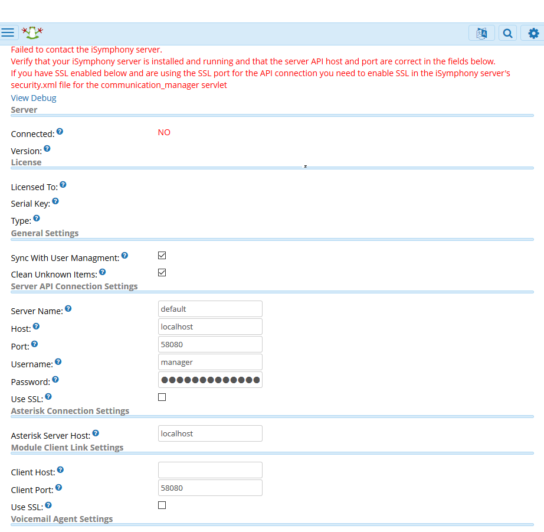

# Tuesday, July 2, 2019
- MEMO: download two pdf files on tcp udp and packet analysis
- MEMO: signup for GNS3 from udemy
- MEMO: I earned Freepbx Junior Memeber status on trusted level 2, perks inlcude send invitations, group personal messages and create  personal topics. 
- MEMO: anybody has yet to show up for work

## Tasks
- [X] TASK: start configuring my pc for virtualization with bios setup
- [X] TASK: read packetanalysisusingwireshark.pdf
- [X] TASK: lunch at Boudin-style stew as the regular place is sold out
- [X] TASK: add isymphony license image 
- [X] TASK: emmet for adding tags not working
- [X] TASK: checkout workstation setup https://www.youtube.com/watch?v=HUzWnkfxcok
- [X] TASK: checkout GN3 and EVE home pages for instructions and demos
> almost same with Dynamips in design and operability, what about IOS and Virl?

## Notes
- NOTE: [(png) isymphony-license](./02/isymphony-license.png)
- NOTE: [gns3 setup and instructions](./02/gns3_setup_and_instructions.md)

## timestamp
<pre>
9:37 AM ~   10:23 AM
~ ~ ~ ~     10:44 AM
10:44 AM ~  11:17 AM
~ ~ ~ ~     11:49 AM
12:24 PM ~  1:35 PM
~ ~ ~ ~     2:41 PM
3:17 PM ~   
</pre>

