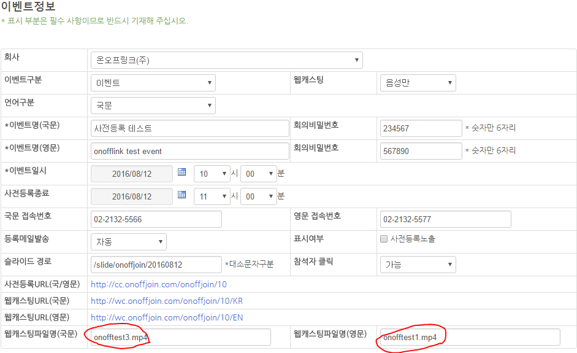

ONOFFJOIN

Streaming Service

User Guide

>   작성자 : 신유진

**목차**

**exe program 사용법**

필요한
실행프로그램-------------------------------------------------------------------------------------------------3

실행 프로그램 사용
방법--------------------------------------------------------------------------------------------4

1.  File
    Zilla-------------------------------------------------------------------------------------4

2.  Navicat
    Premium--------------------------------------------------------------------------8

3.  Adobe flash
    media----------------------------------------------------------------------12

**Wowza web streaming 사용법**

Wowza Streaming Engine
접속---------------------------------------------------------------------------------15

고객사 ID에 맞게
개설---------------------------------------------------------------------------------------------19

**Onoffjoin.master 사용법**

Onoffjoin 전체적
사용법------------------------------------------------------------------------------------------23

3가지 Streaming 구분과
사용법---------------------------------------------------------------------------------33

1.  Audio(only) 오디오만 – 디자인은
    업체별-------------------------------------------------------33

2.  Audio + Data (데이터
    캐스팅)--------------------------------------------------------------------37

3.  Video(only)---------------------------------------------------------------------------------41

>   *exe program 사용법*

-   필요한 실행 프로그램 항목별 간단 설명

파일질라(File Zilla) / 나비캣 프리미엄(Navicat Premium) / 어도비 플래시
미디어(Adobe Flash Media)

1.  파일질라 (File Zilla) : web ftp 실행 프로그램으로 현재 서버인
    115.68.116.218에 접속하여 내부 소스를 분석하고 작업하는 일을 한다.

2.  나비 캣 프리미엄(Navicat Premium) : DB(Data Base) Program으로 현재
    onoffjoin에 있는 정보들이 저장되어있는 Data를 보고, 수정, 편집, 삭제 할 수
    있는 기능을 가지고 있다.

3.  어도비 플래시 미디어(Adobe Flash Media) : 실시간 송출 프로그램으로 사후일
    때는 필요가 없지만 실시간으로 Stmp로 오디오나 비디오를 송출할 때 쓰이는
    프로그램이다.

-   실행프로그램 사용법

**File Zilla**

-   실행프로그램을 다운 받는다.

>   경로 : SVN(D:\\Share\\2.Developing\\onoffjoin exe\\
>   FileZilla_3.20.1_win64-setup

>   다운로드 완료 후 나오는 첫 화면

>   총 5개의 레이아웃으로 구성되어 있고, 간단히 왼쪽은 현재 데스크탑의
>   디렉토리이고, 오른쪽은 접속할 서버의 디렉토리이다.

>   서버 연동 법 : 파일(F) – 사이트 관리자(S) 클릭

>   사이트관리자를 클릭 하면 위의 화면이 열리게 되고 현재 서버에 접속하기 위해

>   *새 사이트(N)을 클릭*한다.

>   새사이트(N) – 일반탭 에서 접속하려는 서버를 정보를 입력한다.

1.  Onoffjoin website part (현재 cc.onoffjoin.com/master 부분 개발 소스가 저장)

>   호스트(H) : **115.68.120.121**

>   프로토콜(T) : **FTP – 파일 전송 프로토콜**

>   암호화(E) : **TLS를 통한 명시적 FTP가 가능한 경우 사용**

>   로그온 유형(L) : **일반**

>   사용자(U) : **onofflink**

>   비밀번호(W) : **ool5566?**  
>   

1.  Wowza vod part(현재 사후로 걸려있는 mp4파일들 저장)

>   호스트(H) : **115.68.116.218**

>   프로토콜(T) : **FTP – 파일 전송 프로토콜**

>   암호화(E) : **TLS를 통한 명시적 FTP가 가능한 경우 사용**

>   로그온 유형(L) : **일반**

>   사용자(U) : **vod**

>   비밀번호(W) : **vod5566?**  
>   

이렇게 두개의 서버에 모두 접속이 완료 했을 경우 (왼쪽onoffjoin web 오른쪽 wowza
vod)

1.

2 .

Onoffjoin web server wowza vod server

**Navicat Premium**

-   실행프로그램을 다운 받는다.

>   경로 : SVN(D:\\Share\\2.Developing\\onoffjoin exe\\이관.zip

>   다운로드 완료 후 나오는 첫 화면

>   처음 접속했을 경우는 연결하려는 DB(데이터 베이스)와 connection(연결)을
>   해야만 사용 할 수 있다.

>   위 사진의 Connection 부분을 클릭 한다.

>   ”Connection”을 클릭 한 후 “PostgreSQL”을 선택한다.

>   \*Navicat은 해당 오라클이나 MySQL 같은 DB프로그램을 직접 설치하지 않아도
>   해당 IP주소와 port 넘버로 접속이 가능한 프로그램이다.

>   PostgreSQL을 클릭하면 새롭게 연결할 Connection 정보를 입력하는 창이 열린다.

>   DB Connection 정보

1.  PostreSQL

2.  Host : 115.68.120.121

3.  Port : 5432

4.  Initial name : onoffdb

5.  UserName : onofflink

6.  Pw : ool5566?

>   해당 정보를 열린 창에 입력 후 “OK”버튼을 누르면 onoffdb에 성공적으로
>   연결된다.(아래 사진 참조 : 성공적으로 연결된 상태)

>   현재 navicat 프로그램에서 사용하고 있는 사항은 select와 insert, update,
>   delete와 같은 간단한 쿼리가 전부이다.

>   Select문은 직접 쿼리문을 작정할 필요 없이 “Table” tab에서 확인이 가능하다.

>   그리고 insert, update, delete같은 기능은 “Query” tab에서 “New Query”로
>   들어가 직접 쿼리문을 완성 후 “Run”을 실행하면 DB에 적용된다.

왼쪽에 위치한 사진은 현재

onoffdb내부 Table 목록으로 33개의 Table이 존재하고 있지만 이중에서 실제
사전등록에 쓰이는 중요한 테이블은 10가지 내외이다.

\***acra_image_files** : 현재 고객사별 등록된 로고의 저장 테이블이다.

>   \***acra_user** : 현재 고객사의 정보를 저장하는 Table로 고객 사 ID, PW,
>   이름, 문의 전화 번호와 같은 데이터들이 저장되어 있다.

>   \***code** : 총 8개의 컬럼으로 이벤트와 컨퍼런스콜와 국영문을 구분하는 인자
>   값이 저장되어 있다.

>   \***event** : 현재 생성한 이벤트 즉 회의방이 저장되는 테이블로 회의이름,
>   회의날짜,와 같은 데이터가 저장되어 있다.

>   \***event_party** : 개설된 회의의 사전등록 참석자가 저장되는 테이블로 각
>   회의의 구분은 event_idx라는 회의고유 인덱스넘버로 하고 있다.

>   \***event_slide** : 개설된 회의의 data캐스팅 진행 시 필요한 문서 슬라이드를
>   저장하는 Table로 현재로썬 가장 많은 쿼리가 실행되었다.

>   \***nara** : 국가 코드가 저장되어 있다.

>   \***nara_city** : 국가 도시 코드가 저장되어 있다.

>   \***zipcode** : 대한민국 주소 코드가 저장되어있다.

이외 나머지는 거의 데이터가 없거나 필요 없는 테이블로 임시로 만들어놓은
테이블입니다.

**Adobe Flash Media**

>   실행프로그램을 다운 받는다.

>   경로 : SVN(D:\\Share\\2.Developing\\onoffjoin exe)

>   다운로드 완료 후 나오는 첫 화면

처음 접속 했을 경우 나오는 화면이다

Video

>   Device : Osprey-230 Video Device 1

>   Format : VP6

>   Frame Rate : 24.00 (프레임 평균)

>   Input Size : 80x60 (최대한 작게)

>   Bit Rate : 100Kbps 80x60 (최대한 작게)

Audio

>   Device : Osprey-2W0 Audio 1 Unbalance

>   Format ; MP3

>   Channels : Stereo

>   Sample Rate ; 22050Hz

>   Bit Rate : 40Kbps

>   Volume : 최대로 올린다.

RTMP

>   FMS URL :

>   rtmp://115.68.116.218/onoffTest

Backup URL : -

Stream : onofflink

(개발소스 내에서 onofflink로 통일 함)

현재 <http://cc.onoffjoin.com/webcast/onoffjoin/onoff.php> 내부 stmp 소스

FMS URL : rtmp://115.68.116.218/onoffTest 부분의 “onoffTest”는 audio casting시
고객사 아이디 명으로 입력 시 실시간 오디오 캐스팅 진행이 가능하다

예를 들어 고객가 아이디가 samsunglife인 경우 FMS URL에

rtmp://115.68.116.218/samsunglife로 입력 시 삼성생명 고객사로 개설된 회의방에
실시간으로 웹캐스팅이 스트리밍 되게 된다.

\*참고 : 하지만 송출구분이 순차와 동시로 나뉠때는 순차일때는 ID로 동일하지만
실시간으로 동시에 다른 언어의 스트리밍을 위해서는 2대의 PC로 ID_KR 이나
ID_EN으로 뒤에 언어를 입력해서 구분한다. Ex) samsunglife_KR, samsunglife_EN

>   *Wowza web streaming 사용법*

-   Wowza Streaming Engine 접속

>   115.68.116.218:8088/enginemanager

>   Sign In

>   UserName : **onofflink**

>   Password : **ool5566**

UserName과 Password를 입력한 후 나오는 첫 메뉴 Home 화면

메뉴구성은 3가지로 와우자 스트리밍 엔진의 정보를 나타내주는 Home과, 현재
스트리밍 되고 있는 log파일들과 사용자 정보를 수정할 수 있는 Server, 그리고
실시간 스트리밍에서 중요한 부분인 Application이 있다.

\*Server

server 내부 메뉴들 세부사항 정리

\- Server Setup : 현재 와우자 스트리밍 엔진에 대한 전반적인 정보와 라이선스키가
있고 편집 가능

\- Server Monitoring : CPU, Heap, Meomory, Total Disk 의 내용이 한눈에 보기 쉽게
그래프형식으로 보여지고, 날짜에 따라 구분하여 볼 수도 있음

\- Virtual Host Setup : 현재 스트리밍에 사용하고 있는 포트와 아이피 주소정보

\- Virtual Host Monitoring : 가상 호스트 모니터 링으로 Adobe RTMP 1개로 현재
송출 중

\- Transcoder : 여러장치에 스트리밍을 재생시키기 위해 여러 비트 레이트로
변환하고 실시간 비디오 코딩을 하는 시스템

\- Media Cache : 스트리밍 비디오 확장성을 향상하는데 필요(빈도 약함)

\- Users : 사용자 비밀번호를 변경하거나 유저를 추가하는 기능.

\- Source Authentication : Users와 비슷한 기능을 가지고 있음.

\- Performance Tuning :

Java Setting

Server Thread Pools

Media Cache Tuning

Virtual Host Processors

Virtual Host Ports

Virtual Host Thread Pools

\- Logs : 현재 삼성과 sk같은 사후 시스템에 대해 스트리밍 하는 사용자들의
ip정보와 접속한 시간을 알 수 있는 로그 파일이며 각 날짜 대로 조회가 가능하다

\- About : wowza Streaming Engine에 대한 전반적인 서버 정보가 나열되어 있다.

\- Startup Streams :

\- Stream Files :

\- SMIL Files :

\*Application

Appliction을 클릭 시 맨 처음으로 보이는 화면으로 live streaming을 추가하려면

“Live”항목을 선택한다

  
  

-   고객사 ID에 맞게 개설

클릭을 하면 “New Application”이라는 팝업이 뜨게 되고, 입력란에 실시간 스트리밍을
할 회사의 이름을 영문으로 입력한다. (순차일 때 : 회사명, 동시일 때 :
회사명_국문, 회사명_영문(KR,EN)) 그리고 “Add” 버튼을 클릭한다.

입력한 제목으로 live streaming이 생성 되었다.

그 후 스트리밍의 설정 값을 셋팅한다.

1.Source Security : “Edit” 클릭 후 설정 값들을 모두 “open”으로 선택한다. (RTMP
Sources, RTSP Sources, Client Restrictions 모두)

2.Transcoder : “Edit” 클릭 후 Fallback Template에서 **“Audio Only”**를 클릭한다.

3.Incoming Streams : 에서 “Refresh”를 클릭 새로고침 한다.

4.왼쪽 상단의 Restart 버튼을 눌러 재시작 한다.

1번 Source Security 설정

2번 Transcoder 설정

Fallback Template가 Audio Only(Default)로 설정되어 있는 것을 볼 수 있다.

3번 Incoming Streams에서 “Refresh”버튼을 클릭 후

4번 전체에서 Restart 한다

>   *Onoffjoin.master 사용법*

-   Onoffjoin 전체적 사용법

<http://cc.onoffjoin.com/master/> 접속

로그인 ID : admin

패스워드 : 5566 super admin 관리자 정보

-   “운영관리 / 고객사리스트”이다.

-   상단 메뉴바에 중요한 기능은 “이벤트관리 / 이벤트 목록”과

운영관리 – 고객사 리스트로 들어가게 되면 현재까지 등록한 고객 리스트가 보여지고
이 리스트에서 가장 오른쪽의 기능 부분의 버튼 “수정”, “삭제”, “로고등록”,
“폼설정”은 현재 고객정보를 변경할 수 있는 기능이 구현된다. 그리고 “신규” 버튼을
누르면 (28p) 페이지 전환이 이루어 진다.

**고객사 별로 로고를 등록했을 때**

**로고가**

**없을 시** : 왼쪽 캡쳐화면 처럼 팝업창이 보여지고, default값인 onofflink 로고로
들어가게 된다.그리고 파일을 선택한후에 “업로드”버튼을 눌러야 로고가 정상적으로
등록되게 된다.

현재 적용된 로고는 사전등록 안내화면, 사전등록화면, 사전등록 완료화면, 메일 모두
왼쪽 상단에 위치한다.

1.  사전등록 안내 화면 (default 값인 ONOFFLINK 로고, 왼쪽 상단 위치)

1.  사전 등록 화면 (default 값인 ONOFFLINK 로고, 왼쪽 상단 위치)

1.  사전등록 완료 화면 (default 값인 ONOFFLINK 로고, 왼쪽 상단 위치)

1.  회의 접속 안내 메일 (default 값인 ONOFFLINK 로고, 왼쪽 상단 위치)

**로고가**

**있을 시** : 왼쪽 캡쳐화면 처럼 로고를 등록 했을 경우 등록된 로고가 팝업창에
업로드 되고 이를 다른 로고로 변경하고자 하는 경우 “파일선택” 버튼을 클릭 한 후
다른 이미지 파일을 선택하고 삭제하고 하는 경우에는 “로고삭제”버튼을 클릭하면
삭제된다.

\*참고사항 : 현재 로고파일은 png, jpg, git file모두 업로드가 가능하지만 사전등록
페이지 특성상 뒷배경이 어두운 바탕이 되어 배경이 투명한 로고 즉 png파일로
사이즈도 조절하여 올리는 것이 좋을 것으로 고려된다.

ex)로고 기능 개발자님께서 테스트하신 샘플 로고파일로 가장 깔끔하게 로고가
등록됩니다.

\-----로고파일 정보-------

크기:25.6KB

1436x611

PNG 파일

신규등록 (고객)

-   아이디 : 고객에게 제공할 아이디 등록 (중복체크 필수)

-   패스워드 : 고객에게 제공할 패스워드 (패스워드 확인 2번 입력)

-   성명 : 고객사 담당자 성명

-   이메일 : 고객의 이메일이 아닌 회의개설 후 문의 메일을 받을 이메일

-   패스워드 질문 : 필수 사항은 아님

-   패스워드 답변 : 필수 사항 아님

-   전화번호 : 고객의 전화번호가 아닌 회의 개설 후 문의 전화를 받을 번호

-   휴대폰 : 고객 전화번호(정보 등록 용도)

-   SMS 서비스 : 기능 구현되지 않음.

-   회사명 : 고객 회사명

-   회사명 영문 : 고객 회사명 영문

-   부서명 : 담당자 부서명(정보 등록 용도)

이벤트관리 – 이벤트 목록으로 들어가게 되면 현재까지 등록한 고객별 회의(이벤트)
리스트가 보여지고 이 리스트에서 가장 오른쪽의 기능 부분의 버튼 “수정”, “삭제”
현재 고객별 회의(이벤트) 정보를 변경할 수 있는 기능이 구현된다. 그리고
“신규등록” 버튼을 누르면 (31p) 페이지 전환이 이루어 진다.

신규등록 (이벤트)

-   회사 : (등록한 고객사의 리스트가 selectbox로 클릭할 수 있게 구현됨)회사 선택

-   이벤트 구분 : *이벤트*과 *컨퍼런스 콜* 2가지 구분.

    -   이벤트 : 온오프조인 내부 스트리밍 회의

    -   컨퍼런스 콜 : 콜투게더와 DB연동 후 연결 전화번호와 회의 비밀번호 개인
        비밀번호가 있는 회의

-   웹 캐스팅 : 화상+음성, 음성만 2가지 구분.

    -   화상+음성: 동영상을 스트리밍하는 비디오 스트리밍

    -   음성만 : silde문서와 오디오를 스트리밍하는 오디오 스트리밍

-   언어구분 : 국문 영문 국영문 3가지 구분 (크게 구분 없음\_

-   송출구분 : 실시간시 순차(한글로 말한 후 통역) 동시(영문과 국문 다르게 송출)
    2가지 구분

-   이벤트명(국문) : 회의 이름을 국문으로 설정

-   이벤트명(영문) : 회의 이름을 영문으로 설정

-   회의 비밀번호 : 컨퍼런스 콜 접속 시 입력할 회의 비밀번호 설정

-   이벤트 일시 : 회의 일시

-   사정등록 종료 : 사전등록 더 이상 받지 않을 날짜

-   국문 접속 번호 : 컨퍼런스 콜 국문 접속 전화 번호 설정

-   영문 접속 번호 : 컨퍼런스 콜 영문 접속 전화 번호 설정

-   등록메일발송 :

-   슬라이드 경로 : “컨퍼런스 콜/음성만” 회의 시 필요한 silde 자료를 업로드 한
    서버 주소(file Zilla 2.wowza streaming server)

-   회사 홈페이지 URL : 사전등록 완료 후 나오는 페이지에서 맨 하단 중앙 부의
    문구로 들어간다.

-   웹캐스팅파일명 (국문) : 사후에 올릴 파일에 대한 이름으로 mp4파일의 정확한
    파일명과 확장자를 입력한다.

-   웹캐스팅파일명 (영문) : : 사후에 올릴 파일에 대한 이름으로 mp4파일의 정확한
    파일명과 확장자를 입력한다.

-   3가지 Streaming 구분과 사용법

1.  **Audio(only) 오디오만 – 디자인은 업체별**

>   ex ) sktelecom

>   /home/www/onoffjoin/webcast/ [id folder 생성]/ web page link

>   webcast하위에 id로 폴더를 생성한 후 php로 web page 소스를 저장한다.

>   마찬가지로 사후 파일로 내부 소스파일을 변경해주어야 한다.

>   (모두 server에서 작업해야 하는 부분으로 cc.onoffjoin.com/master에서 설정은
>   없음)

>   \*내부 “images”폴더에 있는 6개의 이미지파일 속성들

>   배경화면 web 1개 mobile 1개

>   내부 Conference Call 정보 web version Kor 1개 Eng 1개

>   내부 Conference Call 정보 mobile version Kor 1개 Eng 1개

(왼쪽부터 순서대로)

1.  **2016Q2_en.png**

>   크기 : 65.5KB, 953x962(픽셀)

>   웹, 영문버전

1.  **2016Q2_en_mobile.png**

>   크기 : 30.7KB, 643x660(픽셀)

>   모바일, 영문버전

1.  **2016Q2_kr.png**

>   크기 : 64.1KB, 953x962(픽셀)

>   웹, 국문버전

1.  **2016Q2_kr_mobile.png**

>   크기 : 29.5KB, 643x660(픽셀)

>   모바일, 국문버전

1.  **bg.jpg**

>   크기 : 255KB, 1920x1080(픽셀)

>   웹, 배경

1.  **bg_mobile.jpg**

>   크기 : 107.5KB, 720x794

>   모바일, 배경

>   현재 테스트 버전으로 Audio(only) 오디오 캐스팅만 올려놓은 사이트 주소는

>   <http://cc.onoffjoin.com/webcast/onoffjoin/onoff.php>

>   이고 현재 위 사이트에는 무료 상업배포 가능한 음악파일이 사후로 걸려있습니다.

위의 사진은 현재 웹으로 보는 사이트의 캡쳐본입니다. (국문만 올려 놓았습니다.)

위 사이트의 내부 소스는 현재 이런 식으로 작성되어있고,

사후 파일의 명은 \$vod_name = “onofftest3.mp4”라는 이름의 mp3파일로 현재

User Guide 7페이지 2번 File Zilla 접속 방법에 나와있는 경로 중

onoffjoin폴더 하위에 저장되어 있습니다.

위의 소스 중 \$vod_name = “onofftest3.mp4”를 삭제할시 라이브 스트리밍으로 연결할
수 있게 됩니다.

1.  **Audio + Date (데이터 캐스팅)**

>   데이터 캐스팅 진행 시 :

-   이벤트 구분 : 컨퍼런스 콜을 함께 사용할 회의인지 아닌지 확인 후 설정

-   웹 캐스팅 : “음성만” 설정 후

-   웹 캐스팅 URL 클릭 시

>   화면이 송출되고, 실시간일 때에는 wowza rtmp로 음성이 송출 된다.

>   Slide 파일 설정 시

1.  **PDF 파일을 JPEG 파일로 변환 후**

1.  **/home/www/onoffjoin/slide/ [id folder 생성] / 날짜 또는 분기 / KR or
    EN(국영문선택) 폴더에 jpg파일 저장**

1.  **이벤트 설정 창에서 slide 경로 입력**

>   그리고 사후에 file을 upload시 파일은 모두 mp4파일로 업로드 해야 하고 또한
>   이벤트 설정 페이지에서 파일명을 직접입력 한다.

Wowza server upload 시 / [id folder 생성] / mp4파일 저장

\* 고객에게 제공 할 사전 등록 URL(국/영문)을 복사 후 제공

1.  **Video (only)**

>   웹 캐스팅 진행 시 :

-   이벤트 구분 : 컨퍼런스 콜을 함께 사용할 회의인지 아닌지 확인 후 설정

-   웹 캐스팅 : “화상+음성” 설정 후

-   웹 캐스팅 URL 클릭 시

